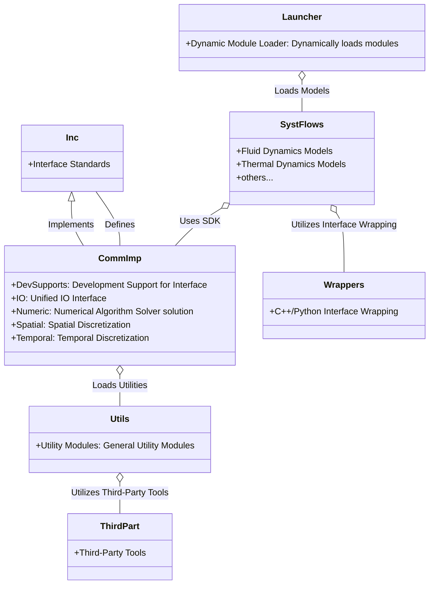
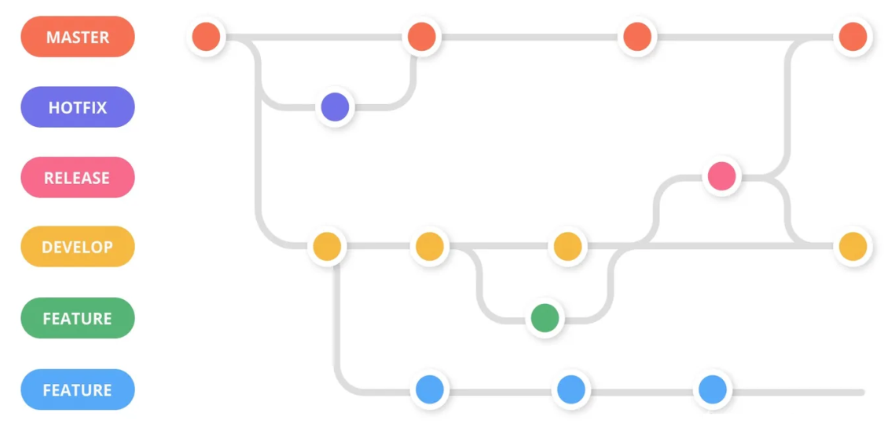

# 绿洲开发小贴士

*OpenOasis Development Tips*

绿洲项目旨在用于学术以及教学用途，因此在设计各种算法和方案的实现细节时，编码的清晰度是重中之重。  
尽管如此，它的所有数值和算法在很多方面都与面向工业的 CFD 代码中使用的数值和算法相似，并鼓励详尽的文档说明。

+ [Tip1-关于模型开发过程和文档：一个待完善的开发建议](#tip1-关于模型开发阶段的划分和文档要求)
+ [Tip2-关于项目的组织结构](#tip2-关于项目的组织结构)
+ [Tip3-关于项目的发布流程](#tip3-关于项目的发布流程)
+ [Tip4-关于项目的编码风格](#tip4-关于项目的编码风格)


+ [Tipx-临时说明](#tipx-临时说明)

---------------------------------------------------------------------------------

## Tip1: 关于模型开发阶段的划分和文档要求

一个模型的开发过程可能会经历以下几个阶段：

**1st: 第一阶段**

提出模型想法，说明开发目的或意义，提供一些基础开发资料、方向或思路；通常来说，`1st`仍处于前期讨论阶段，可以在项目仓库、知乎问题、课题小组或者其他平台提出，  
作为一个 `issue`、一个 `提问`、一个 `报告`、一个 `动态` 发布。

**2nd: 第二阶段**

设计模型算法，解释理论依据，提供算法详细设计（计算链路闭环）。

这个阶段可能主要聚焦在如何使想法落地，怎么样来设计一个完整的计算逻辑或计算链路？  
这个阶段可能还需要初步的原型实现，敲代码和推公式交织进行。

**3rd: 第三阶段**

实施开发方案，定义模型数据和接口，完成模块开发和单元测试。

进入 `3rd` 阶段通常表明模型的算法已经基本稳定，开始工程项目开发。一般的建议是，着手编码前梳理功能模块关系，确定模块集成接口，设计数据结构；同时，在开发过程中遵循一套代码规范和格式化方案，并及时完成单元测试、集成测试，注意代码覆盖度。

**4th: 第四阶段**

通过模型评估方案，测试模型准确性和稳定性，测试参数敏感性。
  
在可靠的单元测试基础上，进一步地进行相对充分的模型用例测试(需要覆盖可预见的常见场景和部分极端场景)，测试模块的稳定性、适用性，分析模块的参数敏感性，进一步地测试模块的准确性及性能表现。

除此之外，可能还包括：

**5th: 维护阶段**

修复模块bug、升级模块功能、重构模块等后期维护。


**模型文档**

为了提高模型和项目的可靠性和可维护性，一个模型组件的文档建议包含：

+ `算法详细设计`，说明算法原理和前提假设，提供完整的计算过程以及涉及的变量定义；
+ `开发接口说明`，说明组件接口，包括接口参数、接口功能和可能的异常等；
+ `测试评估报告`，提供各类测试结果分析报告；
+ `模型操作手册`，说明模型的用户端输入输出格式，演示常见场景下的组件使用。

聚焦于模块的可靠性，`测试评估报告`中应该包括模型与现实的一致性、参数及前提假设的影响、参数真值以及其分布的影响分析，提供模型校核报告、参数敏感性评估报告、网格相关性评估报告，数值算法稳定性评估报告，模型性能评估报告。

[<i class="fa fa-home"></i>](#绿洲开发小贴士)

---------------------------------------------------------------------------------

## Tip4: 关于绿洲的项目架构

```
OpenOasis Project Structure:

+-- /
|   +-- DataAsst/             : 数据助手，用于数据分析、处理和可视化
|   +-- Doc/                  : 项目文档
|   +-- iAgents/              : 深度学习与强化学习解决方案库
|   |   +-- Spark/            : 星火人工智能包
|   |   +-- tests/            : 测试集
|   +-- Models/               : 模型组件集以及数值求解器集
|   |   +-- CommImp/          : 接口的通用实现
|   |   +-- Inc/              : 接口标准
|   |   +-- SystFlows/        : 流体流动模型集
|   |   +-- Utils/            : 通用功能模块
|   |   +-- tests/            : 测试集
|   |   +-- ThirdPart/        : 第三方工具箱
|   |   +-- wrappers/         : c++/python接口封装
|   |   +-- Launcher.cpp      : 模块动态加载器
|   +-- Rsrc/                 : 相关资源
|   |   +-- Benchmarks/       : 项目案例数据集
|   |   +-- Logo/             : 项目标识等
|   |   +-- TheoryBriefs/     : 理论/技术/概念简介
```

在这个项目架构设计中，数值算法内核位于 `Models` 目录下。

`Inc` 目录下存放接口标准，`CommImp` 目录下存放该接口的通用实现方案（SDK）。`SystFlows` 目录下存放基于通用实现方案的流体流动和热量流动模型（App），`Utils` 目录下存放通用功能模块(不依赖接口标准以及任何外部实现，除了第三方库)。

`Launcher.cpp` 是一个模块动态加载器，用于动态加载符合接口标准的模块，并提供统一的接口调用方式。

`CommImp` 中还有次级目录，包括: `DevSupports`(用于拓展接口定义和实现，提供接口对象的辅助函数)，`IO`(用于提供统一的IO接口，不依赖接口标准)，`Numeric`(用于提供数值算法求解器实现，不依赖接口标准)，`Spatial`和`Temporal`(用于提供空间和时间离散的数据定义和处理，不依赖接口标准)。



[<i class="fa fa-home"></i>](#绿洲开发小贴士)

---------------------------------------------------------------------------------

## Tip3: 关于项目的发布流程

项目暂定发布在 GitHub；采用 Git 作为协作开发和版本控制工具；采用 Git Flow 开发模式；版本号采用 `major.minor.patch` 格式。  
项目暂定每年秋分发布大版本更新（LTS 版本），并提前一个月冻结合并请求、执行回归测试。

**开发模式**

简单说来，Git Flow 模式就是给原本普普通通的分支赋予了不同的「职责」：

+ main - 主分支

所有提供给用户使用的正式版本，都在这个主分支上发布。
开发者在此分支 不可进行 push 操作。

+ dev - 开发分支

日常开发所使用的分支，开发者完成的阶段性功能模块将首先被合并到此分支。
开发者在此分支 不可进行 push 操作，只能通过 Pull Request 的方式将个人分支合并到此分支。
开发过程中，要经常与此分支保持同步。

+ feature/xxx - 特性分支

用于某个功能模块的开发，当该功能模块开发任务完成后，通过 Pull Request 的形式进行请求合并，管理员 Code Review 通过后，将该分支合并到 dev 分支；此后，该分支将被删除。
此类分支由开发者个人管理和使用，可以进行 push 操作。
开发过程中，要经常与 dev 分支保持同步。

+ hotfix/xxx - 补丁分支

用于紧急修复 Bug 的分支，可以由 main 或 develop 分支创建。
一旦修复完成，就合并到 main 或 dev 分支（仅能通过 Pull Request 的方式），然后删除。

+ release - 发布分支

发布定期要上线的功能，此分支亦是团队内部测试、阶段性工作验证所使用的分支。
如果发现了 bug，相应的就在 release 分支上或基于 release 分支创建一个分支进行修复，然后重新提交测试。
一旦测试完成，就合并到 main 或 dev 分支（仅能通过 Pull Request 的方式），然后删除。
对于长期支持版本(LTS)，保留其release分支，并在维护期内提供bug修复支持。



负责某个功能的开发人员创建一个对应的本地 feature 分支，并做一些初始化工作之后就推送创建远程分支。功能开发完并自测之后，先切换到 dev 分支将最新的代码拉取下来，再切换回自己负责的 feature 分支把 dev 分支的代码合并进来。如果有冲突，解决合并冲突。然后，到 GitHub 上的项目创建合并请求（merge request）。

项目负责人在收到合并请求时，进行代码审核；有问题就反馈给负责开发的人员去修改，没有就接受请求并删除对应的 feature 分支。

在将某次发布的所需功能全部开发完成时，冻结合并请求，开始交付发布测试。发布测试时创建一个 release 分支部署到测试环境进行测试；若发现了 bug，相应的开发人员就在 release 分支上或者基于 release 分支创建一个分支进行修复。release 分支上不再接受新功能提交。

当确保某次发布的功能可以发布时，将 release 分支合并到 dev 和 main 分支并打上 tag。

当发现线上环境的代码有小问题或者做些文案修改时，相关开发人员就直接从 main 分支切出 hotfix 分支进行修改后合并到 main 和 dev 分支并打上 tag。如果是相当严重的问题，可能就得回滚到上一个 tag 的版本。

**分支命名**

主要分支的名字是固定的，派生分支是需要自己命名。强烈推荐用如下形式的命名规范：

* feature：按照功能点（而不是需求）命名；
* release：用发布时间命名，可以加上适当的前缀；
* hotfix： GitHub 的 issue 编号或 bug 性质等。

**功能提交**

* 提交频率

每个提交应该只包含一个逻辑上的更改或修复，这样可以更容易追踪和理解每个提交的意图。
建议将每个commit用时控制在 3 小时内，鼓励提高提交频率。
避免将多个不相关的更改混合在一个提交中，以免给代码审查和版本控制带来困扰。

* 提交信息格式

提交信息的格式通常是：“[类型]: 描述”。
提交类型（type）指这个提交所属类别，可以是feat、fix、docs、style、refactor、test、chore等。
描述（description）是对提交的简短描述，应尽量清晰明了，突出关键信息。

* 提交信息内容

提交信息应该描述清楚修改的内容，不要使用模糊的词汇。
尽量提供一些上下文信息，例如为什么做出这个更改、解决了什么问题、有什么影响等。
如果有关联的问题（如GitHub Issue等）或任务，可以在提交信息中引用相关的编号。

**Github原生开发**

* Actions 和 Security

通过 github actions 和 security（code scanning）实现linux、windows、macos平台下的 ci 方案。

* Issues

通过 github issues 登记开发工作（保留feat、bug等开发足迹）。

* Discussions

通过 github discussions 进行团队沟通交流。
通过 issues 当然也可以讨论，不过更多是已确定的 feat 或 bug。

* Projects

通过 github projects 进行开发计划和进度管理，控制版本发布 。


[<i class="fa fa-home"></i>](#绿洲开发小贴士)

---------------------------------------------------------------------------------

## Tip4: 关于项目的编码风格
  
在开发过程中培养代码工程素养，对代码“有讲究”，有助于我们开发更可靠和好维护的模型模块：

+ 统一的命名逻辑、良好的封装隔离、清晰的数据流，能帮助控制代码的复杂度。
+ 美观、符合直觉、直白的代码。
+ 好的代码读起来有一种韵律感，能让人一天都很开心。

对于单个概念，定义好其内涵外延；对于多个概念，梳理好其层次关系。映射到代码上，就是不同类的职责清晰划分。

但需要声明，不同的阶段对讲究程度要求是不一样的，如何抉择呢？这里可以引入一个参考度量：**生命周期**。
生命周期越长的代码，一定要写的越干净；临时使用代码，比如原型、脚本，就可以不讲究一些。反过来，也正是干净的代码才能成就超长的生命周期。

在软件项目开发中，代码的规范性主要包括几个方面：

+ 代码重复率；
+ 命名的规范；
+ 单元测试的覆盖率；
+ 日志打印的规范性。


**编码风格**

绿洲项目中主要参考 [华为编程风格](https://www.bookstack.cn/read/openharmony-1.0-zh-cn/contribute-OpenHarmony-cpp-coding-style-guide.md)，差异在于：

1. 成员变量用前缀 `m` 标识，不适用后缀 `_`。

2. 文件名可以使用大驼峰命名。


**代码注释**

我们完全不介意你的注释是代码的2倍、3倍 ...，你的代码、你的成果，你想说什么、想说多少都可以。


**日志**

良好的系统，可以通过日志进行问题定为。除了在本地代码上复现、调试外，还要能够通过丰富合理的日志信息还原问题现场，发现错误位置和原因。

*为什么打日志*

+ 跟踪程序的警告和错误，标识程序运行中的危险操作、错误操作；
+ 跟踪崩溃bug；
+ 跟踪性能下降的问题范围，通过日志提供的详细执行时间记录找出应用的性能瓶颈；
+ 跟踪操作流程，获取操作发生的具体环境、操作的结果；

*什么时候该打日志？*

1. 经常以功能为核心进行开发，应该在提交代码前，可以确定通过日志可以看到整个流程；

*日志分级*

1. `ERROR`。该级别日志发生时，已经影响了用户的正常使用，通常程序抛错、中止。主要类型有：
+ 读写配置文件失败
+ 所有第三方对接的异常(包括第三方返回错误码)
+ 所有影响功能使用的异常

2. `WARN`。该级别日志不应该出现但是不影响程序继续运行的问题。主要类型有：
+ 异常：不明确异常，只进行了简单的捕获抛出，需要打印这种笼统处理的异常
+ 有容错机制的时候出现的错误情况
+ 找不到配置文件，但是系统能自动创建配置文件
+ 性能即将接近临界值的时候
+ 非预期执行：为程序在“有可能”执行到的地方打印日志
    + switch case 语句块中的 default
    + if else 语句块中很少出现的 else 情况
    + try catch 语句块中 catch 分支

3. `INFO`。该级别日志主要用于记录系统运行状态、等信息，常用于反馈系统当前状态给用户。主要类型有：
+ 系统操作行为：读写文件、定时任务等
+ 不符合业务逻辑预期：打印关键的参数
+ 对外提供的接口入口处：打印接口的唯一标识和简短描述，并且要将传入的参数原样打印
+ 调用其它系统接口的前后：打印所调用接口的系统名称/接口名称和传入参数/响应参数
+ 系统模块的入口与出口处：可以在重要方法级或模块级记录输入与输出
+ 服务状态变化(尽可能记录线索)：程序中重要的状态信息的变化应该记录下来
+ 一些可能很耗时的业务处理：批处理，IO操作
    + 程序运行耗时：通过它可以跟踪为什么系统响应变慢或者太快
    + 大批量数据的执行进度

4. `DEBUG`。该级别日志的主要作用是对系统每一步的运行状态进行精确的记录。
注意： 在生产环境中不能打印DEBUG级别的日志，DEBUG级别的日志只能用于开发调试或测试环节，同时在输出DEBUG级别的日志的时候，也应该依据项目组的开发需求打印日志，尽量做到：
+ 开发人员和测试人员都能看懂
+ 通过阅读DEBUG级别的日志后不需要重现问题，就能准确的定位解决问题

*日志格式*

+ 使用参数化信息的方式；
+ 使用 `[]` 进行参数变量隔离；
+ 相同的日志信息不能在不同级别中重复；
+ 日志内容包括 “时间 进程|线程 级别 模块 Filter(用于查找log) 内容”；


[<i class="fa fa-home"></i>](#绿洲开发小贴士)

---------------------------------------------------------------------------------

## Tipx: 临时说明

暂无。

---------------------------------------------------------------------------------