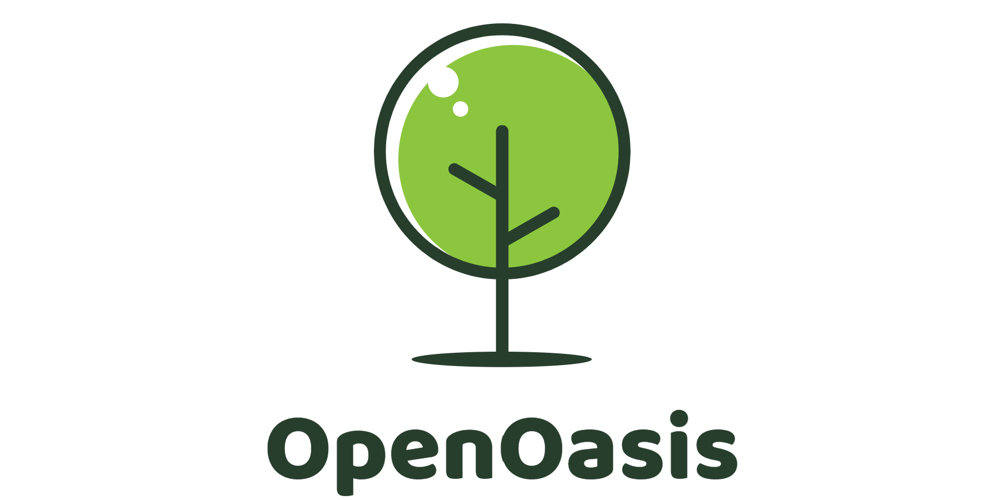

---------------------------------------------------------------------------------

## 什么是绿洲？

[简体中文](README.md) | [English](README.md)

OpenOasis，绿洲，作为一个物理世界数学模型的数值模拟实验项目，希望能帮助理解理论概念、  
数值方法和现实数据；同时，提供一个标准化的平台来尝试新想法和新方案。  

绿洲 项目参考 `OpenFoam` 的算子离散方案，针对`雷诺输运模型`实现一套通用的数值求解器。  
同时，基于 `OpenMI 2.0` 接口规范实现一套模型耦合框架。  
面对蓬勃发展的人工智能技术，绿洲积极尝试引入深度学习和强化学习等新思路在智能辅助设计、  
优化和控制等方面的应用。

---------------------------------------------------------------------------------

## 如何使用？

---------------------------------------------------------------------------------

## 现在加入！

---------------------------------------------------------------------------------

## 更多

---------------------------------------------------------------------------------

