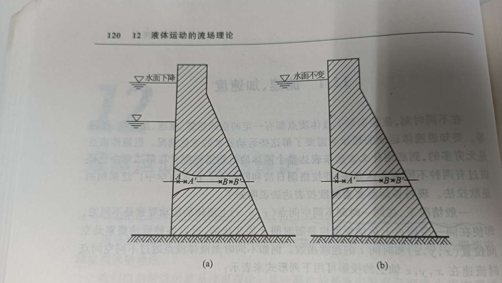
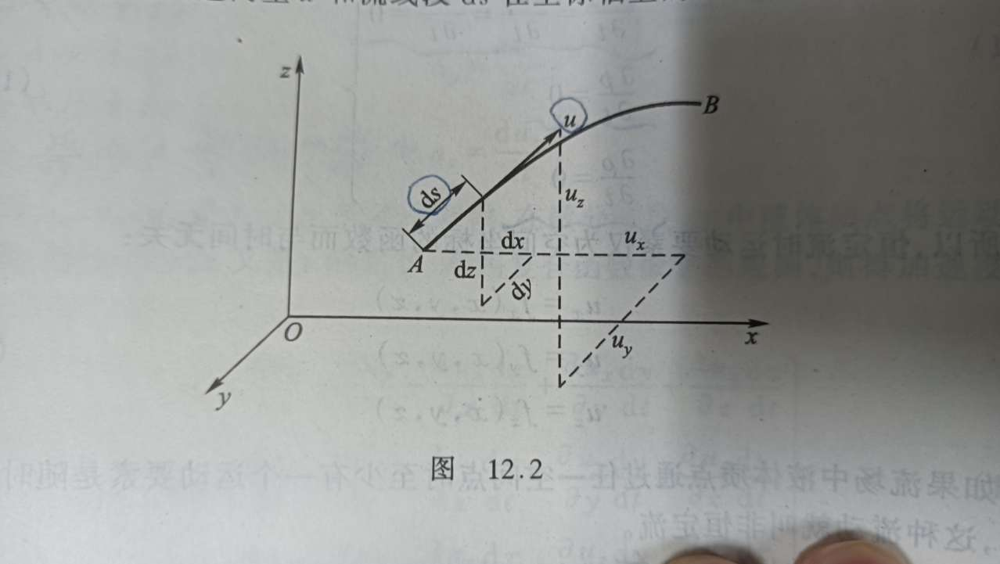

---------------------------------------------------------------------------

## Navier-Stokes Equations

*流体力学·NS方程组*  

**流场理论**，将流体运动看作是充满一定空间而由无数流体质点组成的连续介质运动。其中，
运动流体所占据的空间，叫做 **流场**。

不同时刻，流场中每个流体质点都有各自的空间位置、流速、加速度、压强等，研究流体运动
规律就是求解流场中这些运动要素的变化情况。

分析方法是在流场中任意取出一个 **微小平行六面体** 来研究，应用机械运动的一般原理，
求出表达流体运动规律的微分方程。
在该方法中，将流体运动看作是三维流动，各项运动要素均是空间坐标 (x, y, z) 的函数。

*质点无限多，要如何描述整个流体的运动规律？*

**欧拉法**，通过观察不同流体质点通过固定的空间点的运动情况来了解整个流场的流动情况，
即着眼于研究各种运动要素的 **分布场**。
采用欧拉法，可把流场中运动要素 f 表示为空间和时间的函数：$ f = f(x, y, z, t) $。

采用欧拉法，将目光聚焦在空间内水流的流动情况，分析对象是空间点处的运动要素变化情况，
而不去追究具体的流体质点的运动轨迹。

---------------------------------------------------------------------------

### Velocity、Acceleration、Density & Pressure

*流速、加速度、密度 和 压力*

一般情况下，同一时刻不同空间点 (x, y, z) 上流体的运动要素是不同的，即使在同一点上
运动要素也是随时间 t 变化的。
不同时刻流体质点在不同空间点的 **流速 u** 在个方向的投影：

$$\begin{cases}
u_x = f_x(x, y, z, t) \\
u_y = f_y(x, y, z, t) \\
u_z = f_z(x, y, z, t) \\
\end{cases}$$

1. 若令 x,y,z 为常数，t 为变数，则得到不同时刻同一空间点处流体质点的流速变化情况；
2. 若令 t 为常数，x,y,z 为变数，则得到同一瞬间流场内不同空间点上质点流速分布情况。

其中，情况2 即 **流速场**，一般的：
+ 同一空间点上不同质点通过时的速度是不同的，即流速随时间变化；
+ 同一瞬间下不同空间点的流速也是不同的，即流速随空间位置变化。

在时刻 t，流场中 $ A, A' $ 点 x 方向投影流速分别为 $ u_x, u_x + \frac{\partial u_x}{\partial x}\mathrm{d}x $；  
在时刻 t+dt，流场中 $ A, A' $ 点 x 方向投影流速分别为 $ u_x + \frac{\partial u_x}{\partial t}\mathrm{d}t $, $ (u_x + \frac{\partial u_x}{\partial x}\mathrm{d}x) + \frac{\partial }{\partial t}(u_x + \frac{\partial u_x}{\partial x}\mathrm{d}x)\mathrm{d}t $。  

假设一个流体质点在时刻 t 从空间点 $A$ 经过时间 dt 后运动到 $A'$，**加速度 $a_x$**：
$$a_x = \frac{(u_x + \frac{\partial u_x}{\partial x}\mathrm{d}x + \frac{\partial u_x}{\partial t}\mathrm{d}t) - u_x}{\mathrm{d}t} = \frac{\partial u_x}{\partial t} + u_x\frac{\partial u_x}{\partial x}$$

分析流体质点的加速度，其中由两部分构成：
1. $ \frac{\partial u_x}{\partial t} $，由空间定点上流体质点流速随时间的变化产生，称为 **时变加速度**，又称为 **当地加速度**；
2. $ u_x\frac{\partial u_x}{\partial x} $，由同一时刻下流体质点流速随位置变化产生，称为 **位变加速度**，又称为 **位移加速度**。

在上面的例子中，流体质点的运动轨迹与 x 轴重合，dx = dy = 0，故：
$$\begin{cases}
\frac{\partial u_x}{\partial y}\mathrm{d}y = 0 \\
\frac{\partial u_x}{\partial z}\mathrm{d}z = 0 \\
\end{cases}$$

更一般的情况下，流体质点的 **加速度 $a$** 在个方向的投影：

$$\begin{cases}
a_x = \frac{\mathrm{d}u_x}{\mathrm{d}t} = \frac{\partial u_x}{\partial t} + \frac{\partial u_x}{\partial x}\frac{\mathrm{d}x}{\mathrm{d}t} + \frac{\partial u_x}{\partial y}\frac{\mathrm{d}y}{\mathrm{d}t} + \frac{\partial u_x}{\partial z}\frac{\mathrm{d}z}{\mathrm{d}t}\\
a_y = \frac{\mathrm{d}u_y}{\mathrm{d}t} = \frac{\partial u_y}{\partial t} + \frac{\partial u_y}{\partial x}\frac{\mathrm{d}x}{\mathrm{d}t} + \frac{\partial u_y}{\partial y}\frac{\mathrm{d}y}{\mathrm{d}t} + \frac{\partial u_y}{\partial z}\frac{\mathrm{d}z}{\mathrm{d}t}\\
a_z = \frac{\mathrm{d}u_z}{\mathrm{d}t} = \frac{\partial u_z}{\partial t} + \frac{\partial u_z}{\partial x}\frac{\mathrm{d}x}{\mathrm{d}t} + \frac{\partial u_z}{\partial y}\frac{\mathrm{d}y}{\mathrm{d}t} + \frac{\partial u_z}{\partial z}\frac{\mathrm{d}z}{\mathrm{d}t}\\
\end{cases}$$

因为存在 $ u_x = \frac{\mathrm{d}x}{\mathrm{d}t}, u_y = \frac{\mathrm{d}y}{\mathrm{d}t}, u_z = \frac{\mathrm{d}z}{\mathrm{d}t} $，代入上式又有：

$$\begin{cases}
a_x = \frac{\mathrm{d}u_x}{\mathrm{d}t} = \frac{\partial u_x}{\partial t} + u_x\frac{\partial u_x}{\partial x} + u_y\frac{\partial u_x}{\partial y} + u_z\frac{\partial u_x}{\partial z}\\
a_y = \frac{\mathrm{d}u_y}{\mathrm{d}t} = \frac{\partial u_y}{\partial t} + u_x\frac{\partial u_y}{\partial x} + u_y\frac{\partial u_y}{\partial y} + u_z\frac{\partial u_y}{\partial z}\\
a_z = \frac{\mathrm{d}u_z}{\mathrm{d}t} = \frac{\partial u_z}{\partial t} + u_x\frac{\partial u_z}{\partial x} + u_y\frac{\partial u_z}{\partial y} + u_z\frac{\partial u_z}{\partial z}\\
\end{cases}$$

同样的推理过程，可以得到流体 **密度** 在流场内的变化率（密度作为标量，无方向差别）：

$$\frac{\mathrm{d}\rho}{\mathrm{d}t} = \frac{\partial \rho}{\partial t} + u_x\frac{\partial \rho}{\partial x} + u_y\frac{\partial \rho}{\partial y} + u_z\frac{\partial \rho}{\partial z}$$

同样的推理过程，可以得到流体 **压力** 在流场内的变化率（压力各向同性，无方向差别）：

$$\frac{\mathrm{d}p}{\mathrm{d}t} = \frac{\partial p}{\partial t} + u_x\frac{\partial p}{\partial x} + u_y\frac{\partial p}{\partial y} + u_z\frac{\partial p}{\partial z}$$

*--- 注意：---*
1. 在推导过程中忽略了高阶微量（二阶及以上）。

2. 特别的，对于恒定流（流场任意点处运动要素不随时间变化），
必然满足：
$\begin{cases}
\frac{\partial u_x}{\partial t} = \frac{\partial u_y}{\partial t} = \frac{\partial u_z}{\partial t} = 0 \\
\frac{\partial \rho}{\partial t} = 0 \\
\frac{\partial p}{\partial t} = 0 \\
\end{cases}$
故，恒定流下流场内运动要素仅为空间坐标的函数：
$\begin{cases}
u_x = f_x(x, y, z) \\
u_y = f_y(x, y, z) \\
u_z = f_z(x, y, z) \\
\end{cases}$

3. 特别的，对于均匀流（流场任意点处运动要素相同），
必然满足：
$\begin{cases}
\frac{\partial u_x}{\partial x} = \frac{\partial u_x}{\partial y} = \frac{\partial u_x}{\partial z} = 0 \\
... \\
\frac{\partial \rho}{\partial x} = \frac{\partial \rho}{\partial y} = \frac{\partial \rho}{\partial z} = 0 \\
\frac{\partial p}{\partial x} = \frac{\partial p}{\partial y} = \frac{\partial p}{\partial z} = 0 \\
\end{cases}$
故，均匀流下流场内运动要素仅为时间的函数：
$\begin{cases}
u_x = f_x(t) \\
u_y = f_y(t) \\
u_z = f_z(t) \\
\end{cases}$

4. 恒定流中，时变加速度为 0；均匀流中，位变加速度为 0。 

---------------------------------------------------------------------------

### StreamLine & PathLine

*流线 和 迹线*

**拉格朗日法**，研究流体中各个质点在不同时刻下运动的变化情况，引出迹线的概念；
**欧拉法**，研究流场内同一时刻不同流体质点的运动情况，引出流线的概念。

**流线**，是某一时刻下流速场内的一条几何曲线，在该曲线上每个流体质点的速度向量与该曲线相切。

如图所示，若在流线 AB 上取一微分段 ds，因其无限小，所以可以看作是直线。根据流线的定义可知，
A 点处的流速向量 u 与此流线微分段相切。
这里，分别以ux、uy、uz 和 dx、dy、dz 表示流速向量 u 和微分段 ds 在各坐标轴上的投影。所以有，
$$\begin{cases}
\cos{\alpha} = \frac{\mathrm{d}x}{\mathrm{d}s} = \frac{u_x}{u} \\
\cos{\beta}  = \frac{\mathrm{d}y}{\mathrm{d}s} = \frac{u_y}{u} \\
\cos{\gamma} = \frac{\mathrm{d}z}{\mathrm{d}s} = \frac{u_z}{u} \\
\end{cases}$$

得到，流线的微分方程：
$$ \frac{dx}{u_x} = \frac{dy}{u_y} = \frac{dz}{u_z} = \frac{ds}{u} $$

其中，$ u_i $ 都是 x, y, z, t 的函数；求取流速场内某时刻 t 下流线时，把 t 作为常数代入该方程，积分即可。

**迹线**，是流体流动时，其中某一流体质点在不同时刻下流动经历的路线。

在上图中，若将微分段 ds 看作流体质点在时间 dt 内的位移，dx、dy、dz 表示位移 ds 在各轴上投影。
根据迹线的定义，所以有：
$$\begin{cases}
\mathrm{d}x = u_x\mathrm{d}t \\
\mathrm{d}y = u_y\mathrm{d}t \\
\mathrm{d}z = u_z\mathrm{d}t \\
\end{cases}$$

得到，迹线的微分方程：
$$ \frac{\mathrm{d}x}{u_x} = \frac{\mathrm{d}y}{u_y} = \frac{\mathrm{d}z}{u_z} = \mathrm{d}t $$

其中，$ u_i $ 都是 x, y, z, t 的函数；同时，时间 t 是自变量，质点坐标 x, y, z 均是 t 的函数。

*--- 注意：---*
1. 流线是流场的一个瞬时快照；迹线是不同时刻质点位置集合。
质点运动的各时刻下、在当前位置上，迹线与流速相切；但同时刻回看之前位置，流速已经改变、不再相切。

2. 恒定流中，迹线与流线重合。

---------------------------------------------------------------------------

