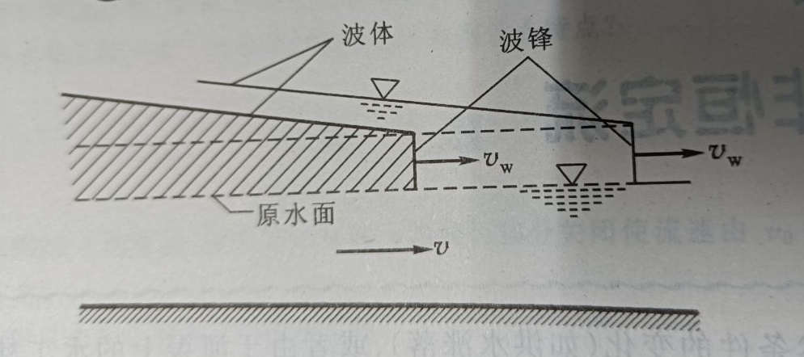
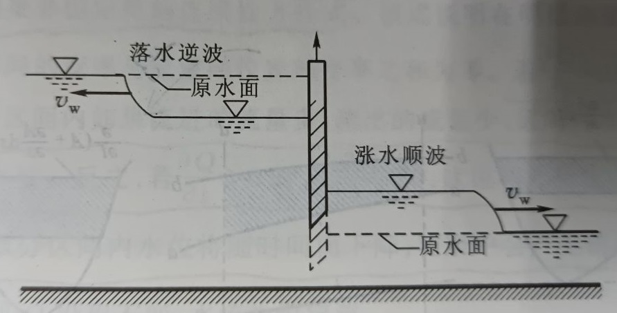
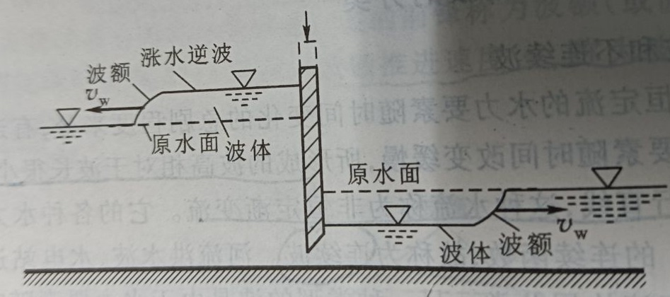
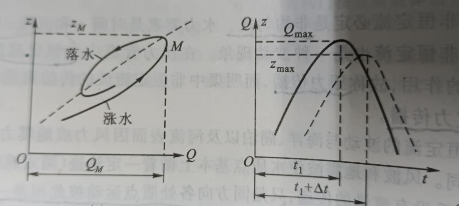
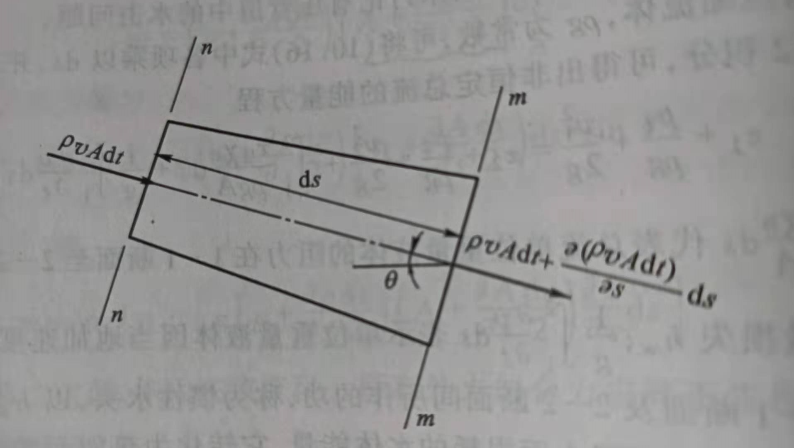
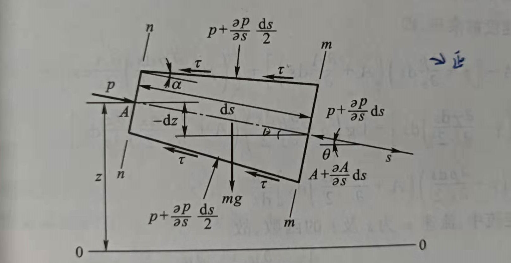

  

---------------------------------------------------------------------------

## Saint--Venant Equations

*水动力学·圣维南方程组*  

**流束理论**，将微小流束看成是水流总流的一个微元体，水流总流就是由无数微小流束组成。  
如此，只要找出微小流束的运动规律，然后对整个水流积分，即得到水流总流的运动规律。  

**微小流束**，充满以流管为边界的一束水流。

在对总流的积分过程中，以断面平均流速替代断面上各点的流速，其误差用动能修正系数、  
动量修正系数等加以修正。因此，  
在流束理论中实际将水流运动视为一元流动，只考虑沿流束轴线方向的运动，而忽略了与，
轴线垂直方向的横向运动，局限。

*面对无数质点构成的连续介质，如何描述整个水流的运动规律？*

**拉格朗日法**，以研究个别水流质点运动为基础，通过对每个质点运动规律的研究获得整个水流的运动规律。  
水流质点，是具有无限小体积的水流质量，而不是水流分子或空间点；是相对于总流、小得类似于一个点。

---------------------------------------------------------------------------

### Unsteady Flow in Open Channel

*明渠非恒定流*

+ 明渠非恒定流必是非均匀流，水力要素是时间 t 和流程 s 的函数， f = f(s,t) 。
+ 明渠非恒定流也是波动现象。
+ 明渠非恒定流所及区域内各过水断面水位流量关系一般不是单一稳定的关系。

风波或地震波产生的波动，使水体质点基本上循着一定轨迹（圆或椭圆）往复运动，几乎没有流量传递，  
只是同方向各处质点运动彼此相差一个相位而形成的水面波形的推进，称为 **振动波** 或 **推进波** 。

对于明渠非恒定流的波动，其是由于在非恒定流明渠的某一位置流量和水位发生改变而形成的，  
以重力、通过水流质点的位移形成波的传播，在波所及区域内引起当地流量和水位的变化，称为 **变位波**。

明渠非恒定流的波由两部分组成：**波峰** 和 **波体**。波峰推进速度 Vw 称为 **波速**，v 为过水断面平均流速。

从明渠非恒定流的水力要素随时间变化的急剧程度划分，  
+ **连续波**，又称 **非恒定渐变流**，要素变化平缓，波高相对波长很小，水流瞬时流线近乎成平行直线；
+ **间断波**，又称 **非恒定急变流**，要素变化剧烈，波高较大，波峰处水面很陡、要素不再是连续函数；

**涨水波**，当波到达后引起明渠水位抬高；**落水波**，当波到达后引起明渠水位下降。  
**顺波**，波的传播方向与水流方向一致；反之，则为 **逆波**。  

常见情景是，明渠上水闸快速启闭产生非恒定急变流（不连续波）。若快速开启水闸，下游流量增加，  
致下游水位迅速上涨，形成涨水顺波向下游传播；上游因泄流增加，水位下降，有落水逆波向上传播。  
同理，当明渠上水闸快速关闭时，上游将产生涨水逆波向上游传播，下游将产生落水顺波向下游传播。

在稳定的没有冲淤变化的明渠内，当水流为恒定流时，因水面坡度为定值，故水位与流量呈单值关系。  
对于明渠非恒定流，由于  
在涨水过程中，同一水位下非恒定流水面坡度更大，因而其流量亦大；  
在落水过程中，同一水位下非恒定流水面坡度更小，因而其流量亦小。  

故而同一水位下水面坡度具有多值关系，使流量相应地具有多值关系，  
形成 **水位流量绳套关系曲线**。  

同时，在明渠非恒定流时，过水断面上的水面坡度、流速、流量、水位的最大值并不在同一时刻出现。  
涨水过程中，由于洪水波的传递，水面坡度快递增加从而首先出现最大值，而后依次再出现最大流速、  
最大流量、最高水位。落水过程中，首先出现最小流量，然后出现最低水位。

*--- 注意：---* 
1. 压力管道中非恒定流波的传播是靠压力差的作用，称为压力传播；  
明渠中非恒定流波的传播是靠重力作用，又称重力传播。

2. 对于不连续波，波峰处水面很陡、水力要素不连续，但波体部分水面仍较为平缓，可近似看作渐变流。

---------------------------------------------------------------------------

### The Continuity Equation of Unsteady Flow

*非恒定流连续性方程*

在非恒定水流中取出长度为 ds 的微分段作为控制体，两端断面为 n-n、m-m。  
设 n-n 断面的面积为 A，流速为 v，水流密度为 ρ。  

在 dt 时段内，流段上  
通过 n-n 断面流入的水体质量为 $\rho v A \mathrm{d}t$，通过 m-m 断面流出的水体质量 $\rho v A \mathrm{d}t + \frac{\partial}{\partial s}(\rho v A \mathrm{d}t) \mathrm{d}s$；  
$$\Rightarrow \rho v A \mathrm{d}t - [\rho v A \mathrm{d}t + \frac{\partial}{\partial s}(\rho v A \mathrm{d}t) \mathrm{d}s] = \frac{\partial}{\partial t}(\rho A \mathrm{d}s) \mathrm{d}t$$

由此，**非恒定流连续方程** 的普遍形式：  
$$\frac{\partial}{\partial t}(\rho A) + \frac{\partial}{\partial s}(\rho v A) = 0$$

方程适用于压力管道非恒定流、弹性管壁压力管道非恒定流以及明渠非恒定流；适用可压缩**水击**水流。

对于明渠不可压缩的非恒定流，则有：  
$$\frac{\partial A}{\partial t} + \frac{\partial v A}{\partial s} = \frac{\partial A}{\partial t} + \frac{\partial Q}{\partial s} = 0 $$

对于不考虑管壁弹性的管道非恒定流：
$$v A = f(t)$$

该方程表明管道非恒定流的流量只随时间变化，在同一时刻下流量沿程不变（如调压系统液面震荡）。

*--- 注意：---*   
1. 压力管道中非恒定流波的传播是依靠压力差的作用，故称压力传播；  
明渠中非恒定流波的传播是依靠重力的作用，故称重力传播。

2. 对于非连续波，在波峰处水力要素不再连续，但在波体部分水面仍较为平缓，可以近似看作渐变流 。

---------------------------------------------------------------------------

### The Motion Equation of Unsteady Flow

*非恒定流运动方程*

在非恒定流中取长度为 ds 的微小流束，s 轴取于恒定流时水流方向一致，轴线与水平线夹角为 θ。  
n-n 断面上密度为 $\rho$，过水面积为 $A$，湿周为 $\chi$，压强为 $p$;  
m-m 断面上密度为 $\rho + \frac{\partial \rho}{\partial s}\mathrm{d}s$，过水面积为 $A + \frac{\partial A}{\partial s}\mathrm{d}s$，湿周为 $\chi + \frac{\partial \chi}{\partial s}\mathrm{d}s$，压强为 $p + \frac{\partial p}{\partial s}\mathrm{d}s$。

*--- 注意：---* 
1. 未考虑微分时段 dt 内 $\rho, A, \chi, p$ 的变化，加入考虑、略去高阶项，推导结果不变。

---------------------------------------------------------------------------

