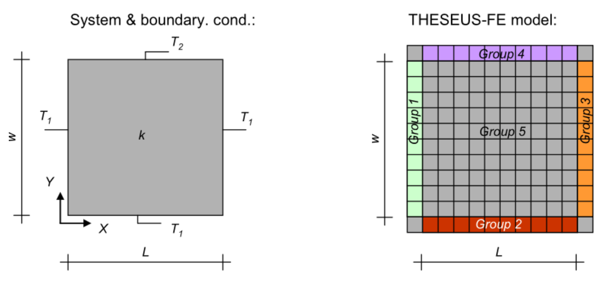
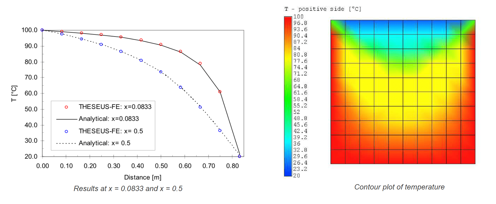

 

---------------------------------------------------------------------------------

# 绿洲测试算例集

模型/算法校核、评估的算例集，包括：  

+ 第一类算例：算例是业内广泛使用的，或存在解析解的，或数据经过复现，可靠稳定。
+ 第二类算例：工程应用场景，描述了模型在现实中的使用方式和应用价值。
+ 第三类算例：算例是为孤例，或未被业内广泛使用，使用前要仔细地评估数据合理性。

算例使用前应仔细评估数据内在合理性、数据间匹配性及适用场景，生成算例评估报告。

---------------------------------------------------------------------------------

## 第一类算例

+ [矩形平板的二维热传导算例](#矩形平板的二维热传导算例)

---------------------------------------------------------------------------------

### 矩形平板的二维热传导算例

[basic-heat-transfer](https://www.theseus-fe.com/zh/zh-resources/zh-validations/zh-basic-heat-transfer)

| 参数 | 数值 | 单位 | 描述 |
|------|------|------|------|
| k    | 81   | W/m*K| 导热系数 |
| L    | 0.833| m    | 长度 |
| w    | 0.83 | m    | 宽度 |
| T 1  | 100  | °C   | 温度边界条件 |
| T 2  | 20   | °C   | 温度边界条件 |

**系统**

**结果**

---------------------------------------------------------------------------------

## 第二类算例

---------------------------------------------------------------------------------

## 第三类算例

---------------------------------------------------------------------------------
